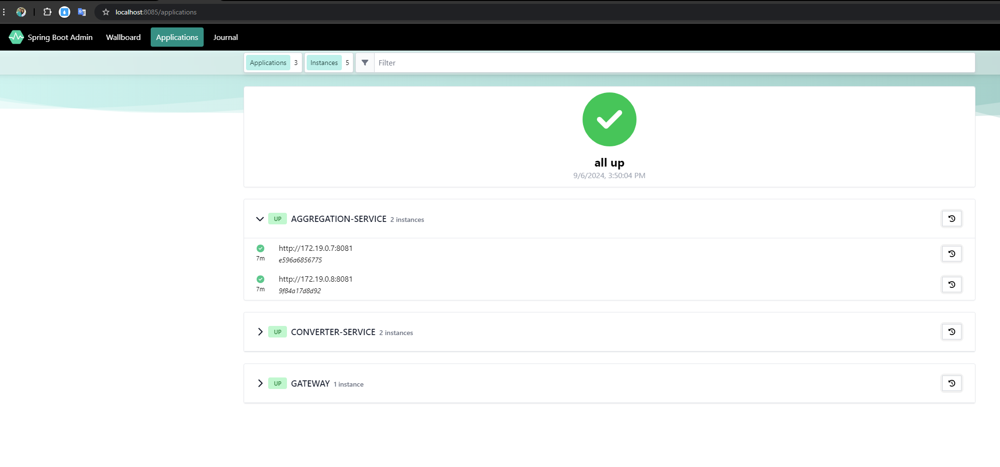
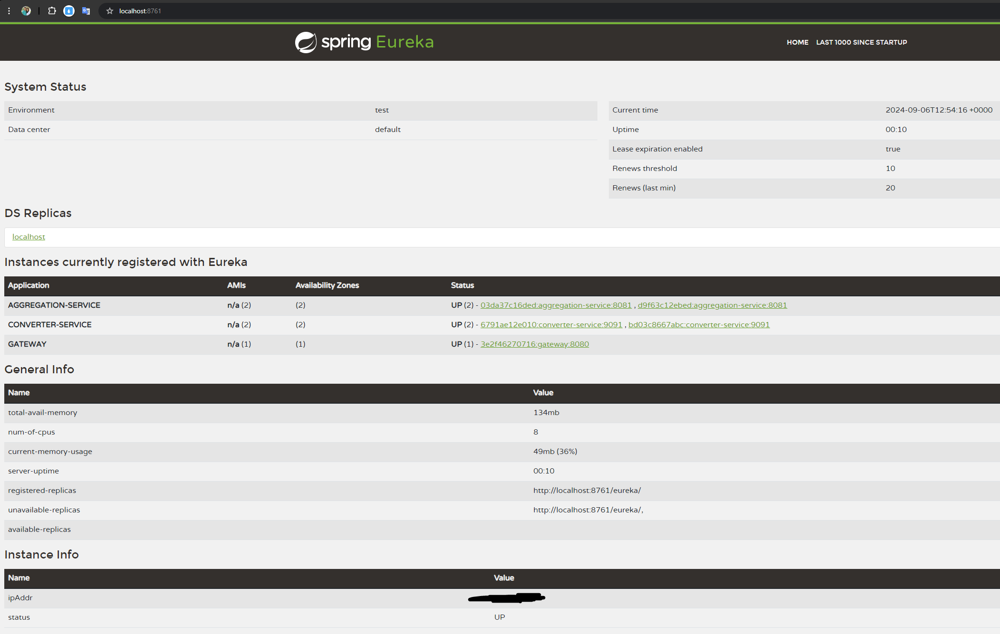
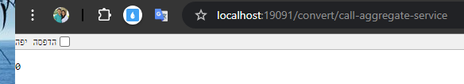
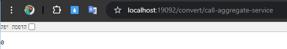
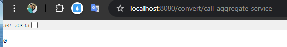

# Microservices Documentation

## Admin

- To view all instances, visit: http://localhost:8080/applications
- You can change the log level (by class) in the log section.

## Zipkin (Tracing Logs)

- To utilize tracing logs, run docker-compose.
- Monitor in the UI by visiting: http://localhost:9411/zipkin/

## Converter Controller

- Swagger documentation: http://localhost:9091/swagger-ui/index.html#/
- Use the following API to see trace-id & span-id:
  ```bash
  curl -X 'GET' \
  'http://localhost:9091/convert/call-aggregate-service' \
  -H 'accept: */*'
  
## Aggregation Controller
- swagger http://localhost:8081/swagger-ui/index.html#/

## Dependabot
- to auto create a PR for upgrade all dependencies (including the parent) and Docker image are up-to-date.
## GitHub Actions
- Build and run tests on the master branch for every pull request or push.
- If any tests fail, the build will also fail.
- View test results under "Actions" in the GitHub repository:
  https://github.com/ReuvenEliezer/micro-services/actions

http://localhost:9411/zipkin/
http://eureka-server:8761/
http://localhost:8761/
docker-compose up --scale aggregation-service=3

Docker Screen-Shot



# Rest call directly to converter-service to aggregation-service to a docker instances (2):


# Rest call to converter-service to aggregation-service via Gateway:


